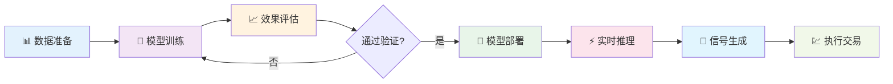
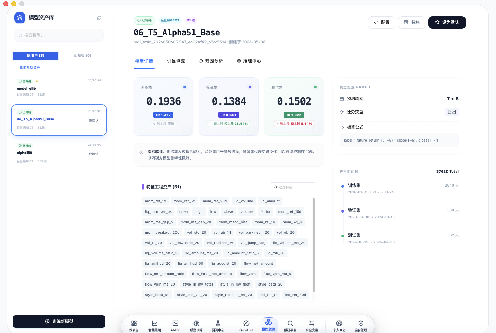
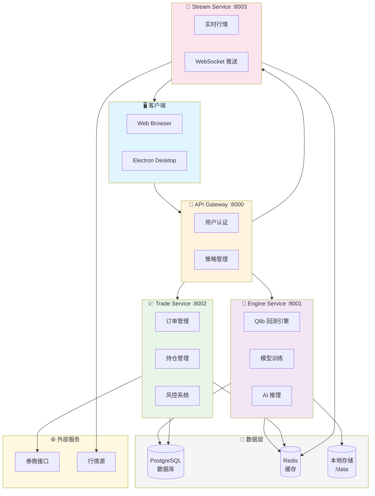

<p align="center">
  
</p>

<h1 align="center">QuantMind</h1>

<p align="center">
  <strong>新一代智能量化交易架构</strong>
</p>

<p align="center">
  <strong>打通模型训练、回测、推理、实盘全流程闭环</strong>
</p>

<p align="center">
  <a href="#-核心特性">核心特性</a> •
  <a href="#-快速开始">快速开始</a> •
  <a href="#-功能演示">功能演示</a> •
  <a href="#-技术架构">技术架构</a> •
  <a href="#-文档导航">文档导航</a>
</p>

<p align="center">
  
  
  
  
</p>

---

## ✨ 核心特性

### 🧠 Qlib 内核驱动

基于微软 **Qlib** 量化框架深度集成，提供业界领先的量化研究能力：

- **LightGBM 模型** — 高性能梯度提升模型，专为金融时序预测优化
- **Alpha158 因子集** — 158 个经典量化因子，覆盖动量、估值、质量等多维度
- **自动化特征工程** — 51 维标准化特征，开箱即用

### 🎯 双引擎回测系统

独创 **Qlib + Pandas** 双引擎架构，灵活应对不同场景：

| 引擎 | 适用场景 | 性能 |
|------|----------|------|
| **Qlib Engine** | 复杂策略、多因子模型、机构级研究 | 极高性能 |
| **Pandas Engine** | 快速验证、简单策略、教学演示 | 轻量极快 |

### 🤖 AI 模型全生命周期管理

从训练到推理，完整闭环：



- **一键训练** — 自动化特征提取、样本划分、超参优化
- **模型版本管理** — 多模型共存，一键切换
- **实时推理** — 每日自动生成交易信号

### 📈 实盘交易对接

支持多券商实盘交易：

- **QMT 券商** — 迅投 QMT 深度对接
- **模拟盘验证** — 实盘前完整模拟
- **风控系统** — 止损止盈、仓位控制、风险预警

---

## 🚀 快速开始

### 环境要求

| 组件 | 版本 | 说明 |
|------|------|------|
| 操作系统 | Ubuntu 22.04+ | 推荐 Ubuntu 24.04 LTS |

**硬件配置：**

| 功能模块 | 最低配置 | 推荐配置 |
|----------|----------|----------|
| 基础功能（智能策略、AI-IDE、回测中心、QuantBot） | 4核 8GB | 4核 16GB |
| 完整功能（含模型训练、模型推理） | 8核 32GB | 16核 64GB |

### 一键部署

在全新的 Ubuntu 服务器上执行：

```bash
curl -fsSL https://gitee.com/qusong0627/quantmind/raw/master/deploy/quick-deploy.sh | sudo bash -s -- --yes
```

部署完成后访问：`http://<服务器IP>`

**默认账号：** `admin` / `admin123`

### 一键更新

已部署服务器可直接执行远程更新脚本，自动拉取最新代码并重建前后端服务（不初始化、不清理数据库）：

```bash
curl -fsSL https://gitee.com/qusong0627/quantmind/raw/master/deploy/update.sh | sudo bash
```


### 离线数据包

部署完成后，需要下载离线数据包以启用完整功能（回测、模型训练、模型推理）：

**下载地址：** [https://oss.quantmindai.cn/data-download.html](https://oss.quantmindai.cn/data-download.html)

数据包包含：
- Qlib 股票特征数据（6000+ 股票）
- 模型特征快照（2016-2026 年）
- 预训练模型文件

安装方法详见：[docs/数据包安装指南.md](docs/数据包安装指南.md)

> 📖 完整部署选项、常见问题 → [docs/部署指南.md](docs/部署指南.md)

---

## 📸 功能演示

### 📊 智能仪表盘

<p align="center">
  
</p>

实时监控账户状态、持仓盈亏、策略表现，一目了然。

### 🔬 快速回测

<p align="center">
  
</p>

分钟级完成策略回测，支持自定义参数、多标的组合、详细绩效报告。

### 🧠 模型训练

<p align="center">
  
</p>

可视化配置训练参数，自动完成特征工程、样本划分、模型训练与评估。

### 🎯 模型管理

<p align="center">
  
</p>

多版本模型管理，一键切换生产模型，查看训练日志与性能指标。

### 📈 模型推理

<p align="center">
  
</p>

每日自动推理生成交易信号，支持手动触发、信号导出、历史回溯。

### 💹 实盘交易

<p align="center">
  
</p>

对接券商实盘，支持自动下单、持仓同步、风险控制。

### 🛡️ 风险管理

<p align="center">
  
</p>

完善的风控体系：止损止盈、仓位限制、黑名单管理、异常预警。

### 📊 高级分析

<p align="center">
  
</p>

深度策略分析：收益归因、风险分解、因子暴露、Benchmark 对比。

---

## 🏗️ 技术架构

### 微服务架构



### 技术栈

| 层级 | 技术选型 |
|------|----------|
| **前端** | Electron + React + TypeScript + Ant Design |
| **后端** | Python 3.10 + FastAPI + SQLAlchemy |
| **回测引擎** | Qlib + Pandas 双引擎 |
| **AI 模型** | LightGBM + Qlib Model Framework |
| **数据库** | PostgreSQL 15 + Redis 7 |
| **消息队列** | Celery + Redis |
| **容器化** | Docker + Docker Compose |

> 📖 完整架构说明 → [docs/系统架构文档.md](docs/系统架构文档.md)

---

## 📚 文档导航

| 类别 | 文档 |
|------|------|
| **部署** | [部署指南](docs/部署指南.md) · [数据包安装](docs/数据包安装指南.md) · [Web部署](docs/Web部署指南.md) |
| **开发** | [Electron编译](docs/Electron编译方案.md) · [开发环境](#-开发环境) |
| **架构** | [系统架构](docs/系统架构文档.md) · [Qlib架构](docs/Qlib架构与回测原理.md) |
| **策略** | [Alpha158训练](docs/alpha158训练计划.md) · [策略比较](docs/策略比较分析.md) · [多模型切换](docs/多模型训练与推理切换设计方案.md) |
| **规范** | [Qlib策略开发](docs/Qlib内部策略开发规范.md) · [回测费用](docs/回测费用配置说明.md) |
| **数据** | [高维特征存储](docs/高维特征存储与统一访问方案.md) · [152维特征方案](docs/QuantMind_152维特征方案规范.md) · [行情快照](docs/行情快照写入规范.md) |

---

## 🧪 测试

```bash
# 单元测试
python backend/run_tests.py unit

# 集成测试
python backend/run_tests.py integration

# 全量测试
python backend/run_tests.py all
```

### 开发环境

```bash
# 后端开发
source .venv/bin/activate
pip install -r requirements.txt
python backend/main_oss.py

# 前端开发
cd electron && npm install && npm run dev
```

> 📖 部署常见问题 → [docs/部署指南.md#常见问题](docs/部署指南.md#常见问题)

---

## 📁 项目结构

```
quantmind/
├── backend/
│   ├── main_oss.py              # 统一入口
│   ├── services/
│   │   ├── api/                 # API 服务
│   │   ├── engine/              # 回测引擎
│   │   ├── trade/               # 交易服务
│   │   └── stream/              # 行情服务
│   └── shared/                  # 共享模块
├── electron/
│   └── src/                     # 前端源码
├── models/                      # 模型文件
├── db/                          # 数据文件
├── deploy/
│   └── deploy.sh                # 一键部署脚本
├── docker/
│   └── Dockerfile.oss           # 镜像构建
├── docs/                        # 文档
└── docker-compose.yml           # 服务编排
```

---

## 🤝 贡献

欢迎提交 Issue 和 Pull Request！

---

## 📄 License

[GNU Affero General Public License v3.0](LICENSE)

---

## 🙏 致谢

- [Qlib](https://github.com/microsoft/qlib) — 微软量化投资平台
- [LightGBM](https://github.com/microsoft/LightGBM) — 微软梯度提升框架
- [FastAPI](https://fastapi.tiangolo.com/) — 现代高性能 Web 框架

---

## 💬 QQ 群

<p align="center">
  
</p>

---

<p align="center">
  <strong>QuantMind</strong> — 让量化交易更简单
</p>
