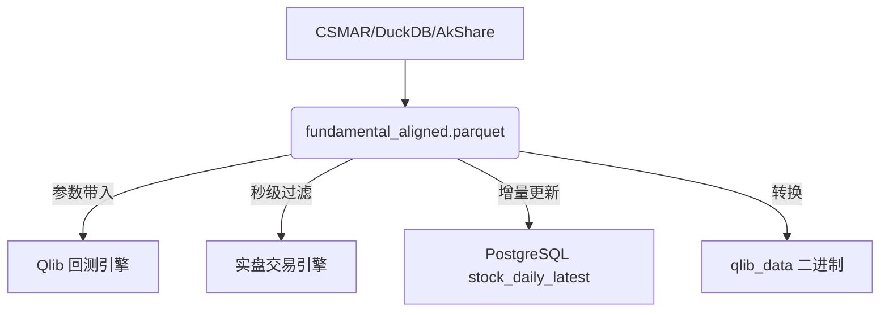

# QuantMind 数据文件使用说明

本目录包含 QuantMind 投研平台所需的全部离线数据文件，部署前请按以下说明完成数据准备。

---

## 目录结构

```
db/
├── feature_snapshots/    # 年度特征快照（2016-2026）
├── qlib_data/            # Qlib 回测数据（日历/因子/标的）
├── custom/               # 核心对齐数据集 (Single Source of Truth)
│   └── fundamental_aligned.parquet  # 投研/实盘统一对齐产物
├── backups/              # 数据库备份
└── README.md
```

---

## 1. custom/ — 投研对齐产物 (Single Source of Truth)

**内容**：`fundamental_aligned.parquet` 是 QuantMind 的核心高维数据集。它深度整合了 2016-2026 年全市场所有标的的行情（OHLCV）、89 维深度因子（估值、质量、技术指标）、资金流向、微观结构以及行业概念标签。

**核心价值**：
- **快捷带入参数**：专为 Qlib 回测和实盘策略设计。用户在编写策略逻辑时，无需自行编写复杂的特征计算代码或进行多表关联（Join），直接调用数据即可。
- **开箱即用**：所有关键字段（如 `pe_ttm`, `roe`, `rsi_14`, `main_flow`, `idx_hs300` 等）均已预计算完成并进行了严格的时间轴对齐。
- **高性能查询**：采用 Parquet 列式存储，支持分钟级的全量数据读取与过滤，极大地降低了量化研究的门槛。

---

## 2. feature_snapshots/ — 特征快照

**内容**：2016-2026 年每年的模型特征 Parquet 文件 + 元数据 JSON，共 152 维特征，主要用于 AI 模型的训练与推理。

---

## 3. qlib_data/ — Qlib 回测数据

**内容**：Qlib 原生二进制格式数据，供 Qlib 引擎直接调用进行回测计算。主要包含 `calendars/` (交易日历) 和 `features/` (基础 OHLCV 二进制)。

---

## 4. backups/ — 数据库备份与导入

### 4.1 核心备份文件
- `stock_daily_latest_2026_full.csv`: 2026 年全量对齐数据（89列），对应数据库中的核心事实表 `stock_daily_latest`。

### 4.2 导入方法 (PostgreSQL)

#### 方法 A：使用 SQL `COPY` (推荐，性能最高)
在数据库终端执行以下命令：
```sql
-- 1. 清空旧数据（可选）
TRUNCATE TABLE stock_daily_latest;

-- 2. 导入 CSV
\COPY stock_daily_latest FROM 'db/backups/stock_daily_latest_2026_full.csv' WITH (FORMAT csv, HEADER true, NULL '');
```

#### 方法 B：Docker 环境一键导入
如果数据库运行在 Docker 容器中（默认容器名为 `quantmind-postgresql`）：
```bash
# 1. 拷贝 CSV 到容器
docker cp db/backups/stock_daily_latest_2026_full.csv quantmind-postgresql:/tmp/

# 2. 执行导入命令
docker exec -it quantmind-postgresql psql -U postgres -d quantmind -c "\COPY stock_daily_latest FROM '/tmp/stock_daily_latest_2026_full.csv' WITH (FORMAT csv, HEADER true, NULL '')"
```

#### 方法 C：自动化同步脚本
直接运行项目内置的同步工具，无需手动操作 CSV：
```bash
python scripts/sync_parquet_to_pg.py
```
> **说明**：该脚本会自动读取 `db/custom/fundamental_aligned.parquet` 并原子性地更新数据库中的 `stock_daily_latest` 表。

---

## 数据逻辑结构



**重要提醒**：`fundamental_aligned.parquet` 是整个平台的“数据心脏”，在进行任何策略研发前，请务必确保该文件已通过 `sync_qlib_from_parquet.py` 等脚本完成最新日期的同步。
