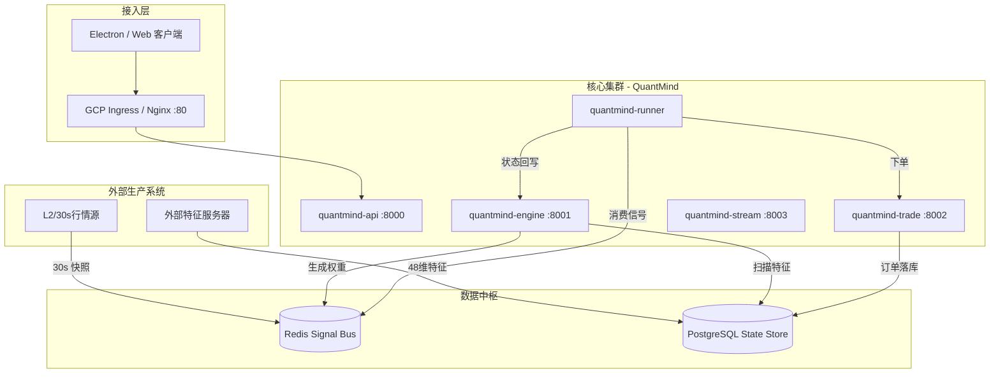

# QuantMind 系统架构文档

## 1. 核心架构演进

QuantMind 已完成从 **18+ 离散微服务** 到 **4 大核心集群** 的架构收敛。
**2026-03-02 重大变更**: 确立了“特征工程外置、权重生成导向”的实盘闭环。本项目核心集群不再负责高负载的 L2 特征计算，转而专注于模型推理与订单执行。

### 1.1 架构拓扑 (V2.1)

---

## 2. 核心集群职责清单 (RC 版本)

| 集群名称 | 端口 | 核心职责 | 实盘数据依赖 |
|:---|:---|:---|:---|
| **quantmind-api** | 8000 | 业务总入口、JWT 认证、用户/策略管理、GCP Ingress 路由。 | PG (Users) |
| **quantmind-trade** | 8002 | **交易大脑**。订单事务管理（先落库后外部请求）、多级风控、持仓核算。 | PG (Orders), Redis (Quotes) |
| **quantmind-engine**| 8001 | **权重引擎**。消费外部填充的 48 维特征，进行 AI 模型推理，生成 fusion_score。 | PG (MarketDataDaily) |
| **quantmind-stream**| 8003 | **展示网关**。接收 30s 行情快照，聚合 K 线提供给前端展示，支撑账户估值。 | Redis (Snapshots) |
| **quantmind-runner**| (无) | **执行单元**。监听信号流，实施自愈重连，执行实盘下单与 E2E 回写。 | Redis (Signals) |

---

## 3. 特征外置模式规范

系统不再内部计算 48 维特征，数据契约如下：

1.  **输入**: 外部服务器将 48 维特征向量以 `JSONB` 格式写入 `market_data_daily` 表。
2.  **处理**: 管理端或调度任务调用 `InferenceScriptRunner` 执行模型目录 `inference.py`，生成当日信号。
3.  **输出**: 权重分数 (`fusion_score`) 通过 Redis Stream 分发给执行器。

---

## 4. 关键自愈与安全机制

### 4.1 交易自愈 (PEL Healing)
执行器 (Runner) 启动时会自动清理 Redis 的 **Pending Entries List**，确保因容器崩溃或网络抖动而挂起的交易信号不会丢失。

### 4.2 订单防御 (Orphan Order Prevention)
`quantmind-trade` 强制执行“本地预落库”原则。任何发往券商的指令必须先在本地数据库产生 `SUBMITTED` 记录，拿到唯一 ID 后方可外发，杜绝“孤儿订单”。

### 4.3 数据库连接自愈
所有核心服务均集成了**指数退避 (Exponential Backoff)** 重连逻辑，能够自动适应 GCP Cloud SQL Proxy 侧车的延迟启动。

---

## 5. 部署说明

### 5.1 镜像版本
生产环境建议使用标签为 `latest` 的 x86 兼容镜像（`--platform linux/amd64`）。

### 5.2 核心配置项 (GCP)
- `DB_CONNECT_MODE=PROXY`: 默认使用 Cloud SQL Proxy 侧车。
- `EXECUTION_CONFIG`: 控制交易模式 (`REAL` / `PAPER`) 及交易日检查。
- `INTERNAL_CALL_SECRET`: 已废弃（DEPRECATED），仅训练容器回调使用。服务间认证改用 `SECRET_KEY` 签发的 service JWT（`X-Service-Token` header）。T6.5-P3 residual, M4 migration。
